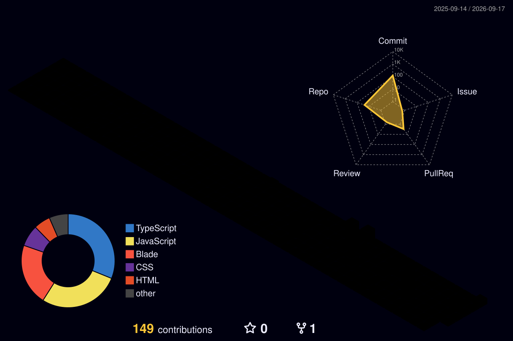

# Hi there! 🐾

  <!-- Cute Waving Cat GIF (Reliable Link) -->
  
  
   
  
  <!-- Dynamic Typing Animation SVG -->
  

---

## 🐱 Welcome to my Cozy Cat Condo!

I'm an **Android Developer** & **Web Craftsman** who loves clean code, UI/UX magic, and everything offline-first.

> [!TIP]
> 🎮 **Play with my [Interactive Cat Portfolio Web App](https://superboy12.github.io/DanielArdiyansah)!**
> You can feed a Virtual Cat Pet, catch yarn in a mini-game, and play with floating toys! 🧶

---

## 🐈 Tech Toy Box

  
Bahasa pemrograman & alat yang saya gunakan:

  

    
    
    
    
    
    
    
    
  

---

## 📊 Statistik GitHub Saya

  <!-- Animated GitHub Activity Graph Line Chart -->
  

 

### 🏙️ 3D Contribution City
Kota kontribusi GitHub saya! (Diperbarui setiap hari).

  

---

🐾 *Meow! Dibuat dengan hangat oleh Daniel Ardiyansah.*
